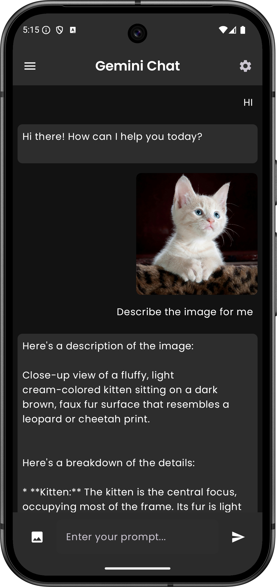
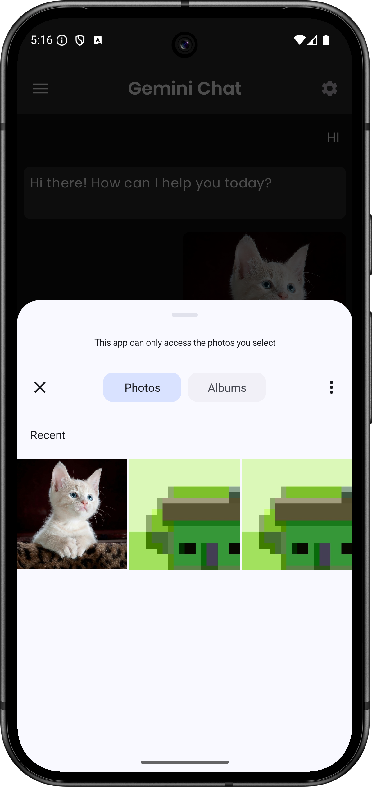

# Chat Gemini : Native Android Compose App
This app leverages the power of Google's Gemini AI to provide detailed descriptions of images. Simply upload an image, and Gemini Chat will analyze and generate a comprehensive text description, highlighting key features and elements.

## Features

* **Image Upload and Analysis:** Upload images directly within the app and let Gemini Chat process them.
* **Detailed Text Descriptions:** Receive accurate and insightful descriptions of the uploaded images, focusing on objects, colors, textures, and overall composition.
* **User-Friendly Interface:** A clean and intuitive interface for easy navigation and interaction with the AI.
* **Powered by Gemini AI:** Harness the advanced capabilities of Google's Gemini for state-of-the-art image understanding.

## Screenshots

Here are some screenshots of the app in action:
<table>
  <tr>
    <td align="center">
      
      <br>pic 1
    </td>
    <td align="center">
      
      <br>pic 2
  </tr>
</table>

# Getting Started Guide

This guide will walk you through the process of integrating Google AI into your Android project. You will obtain an API key from Google AI Studio and insert it into the necessary files for your Android Studio project.

---

## 1. Sign up or Log in to Google AI Studio

1. Go to [Google AI Studio](https://aistudio.google.com/prompts/new_chat)
2. Sign in with your Google account or create a new one if you don’t have one yet.
3. Navigate to the **API keys** or **Credentials** section. (Depending on the interface, this might be under **Project Settings** or a similar tab.)
4. Generate a new API key and copy it to your clipboard.

**Tip**: Make sure you keep your key secure. Never share it publicly.

---

## 2. Configure Your Android Project

1. Open your Android project in **Android Studio**.
2. Locate your `BuildConfig` class (usually in the `app/java/<your-package-name>` folder).
3. Locate your `local.properties` file (in the root folder of your project).

---

## 3. Replace the API Key in `BuildConfig`

In your `BuildConfig` file, find or add the following lines (adjusting for your actual package name and settings):

```java
public final class BuildConfig {
    // Replace YOUR_ACTUAL_API_KEY_HERE with your actual key
    public static final String apiKey = YOUR_ACTUAL_API_KEY_HERE;
}
```
## 4. Replace the API Key in `local.properties`

Open your `local.properties` file (located in the root of your Android project). You should see something similar to:

```properties
## This file is automatically generated by Android Studio.
# Do not modify this file -- YOUR CHANGES WILL BE ERASED!
#
# This file should *NOT* be checked into Version Control Systems,
# as it contains information specific to your local configuration.
#
# Location of the SDK. This is only used by Gradle.
# For customization when using a Version Control System, please read the
# header note.
sdk.dir=/Users/sayed/Library/Android/sdk
apiKey=YOUR_ACTUAL_API_KEY_HERE
```
## 5. Sync and Rebuild
1. In Android Studio, click on File > Sync Project with Gradle Files (or use the Sync button at the top-right).
2. Once the sync completes, go to Build > Rebuild Project.
3. Run your app to verify it can now access the Google AI API using the provided key.


## Contributing

1.  Fork the repository.
2.  Create a new branch (`git checkout -b feature/your-feature`).
3.  Commit your changes (`git commit -m 'Add some feature'`).
4.  Push to the branch (`git push origin feature/your-feature`).
5.  Create a new Pull Request.

## Contact

*   Email: alkamelsayedali@gmail.com   
*   Instagram: https://www.instagram.com/sayed3li97/
*   LinkedIn: https://www.linkedin.com/in/sayed-ali-alkamel/
*   Twitter: https://x.com/Sayed3li97

---
